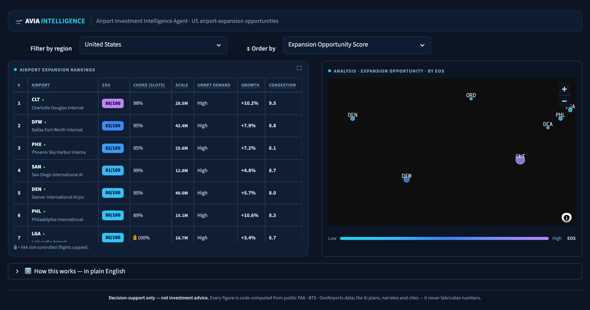

<div align="center">

# 🛫 Airport Investment Intelligence Agent

**A conversational AI that finds the US airports where building terminal / runway
capacity pays off most — where demand is large and growing _and_ the airport is
already choked, so new capacity turns straight into more served flights.**

[](https://www.python.org)
[](https://streamlit.io)
[](https://ai.google.dev)
[](tests/)
[](LICENSE)

[**▶ Live app**](https://airport-investment-intelligence-agent.streamlit.app/) ·
[**Slides**](docs/Airport%20Investment%20Intelligence%20Agent.html) ·
[**Design one-pager**](docs/design.html) ·
[**DESIGN.md**](docs/DESIGN.md)

</div>



---

## Why this is different

Most takes on this problem rank airports by size or growth. But the fund only makes
money where capacity is **choked** — a big, fast-growing airport that still has room
doesn't need a build. Three design choices carry the whole thing:

- **🎯 Choke-gated score.** The Expansion Opportunity Score multiplies *down* when an
  airport isn't jammed, so scale + growth alone can't reach the top. **The investment
  thesis is enforced by the math, not left to the LLM.**
- **🔒 A grounding guard.** If the model ever states a figure without calling a data
  tool, the loop refuses the answer and forces a tool call — so **the LLM never invents
  a number.**
- **🧭 Honest by construction.** Per-airport data-confidence flags, proxies labelled as
  such, and a clear line that this ranks *capacity need, not ROI*.

## What it answers

| Ask it… | …and it |
|---|---|
| _"Which New England airports are strong expansion candidates?"_ | ranks a region by the choke-gated score |
| _"Compare LA and Santa Ana congestion levels."_ | resolves the names → LAX / SNA, compares metrics |
| _"What % of flights out of Anchorage are long-haul?"_ | pulls the long-haul profile |
| _"What's the unmet flight demand at SFO, and why?"_ | estimates spilled demand **and explains the drivers** |

…plus conversational follow-ups (_"why is it below the first?"_), by **chat or voice**.

## Architecture

```
  you  (chat / voice)
        │
        ▼
  Agent loop  (Gemini / Claude, tool-use)        ← plans, picks tools, narrates
        │  7 typed tools
        ▼
  Deterministic engine  (src/scoring.py)         ← computes EVERY number
        │  reads
        ▼
  Cached snapshot  (data/airport_snapshot.parquet)
  built once from public FAA · BTS · OurAirports data
```

**AI plans and explains; code decides every number.** The grounding guard makes that
split *enforceable*, not aspirational — which is what makes an investment tool
trustworthy.

## The score — Expansion Opportunity Score (EOS)

```
EOS = ( Choke 45% + Demand 30% + Scale 25% ) × ( 0.60 + 0.40 × choke )
```

Each pillar is a 0–100 **national percentile** (unit-free, outlier-robust):

- **Choke** — delays + cancellations + runway utilization + a bonus for FAA
  slot-controlled airports (JFK / LGA / DCA / EWR). *Computed.*
- **Demand** — year-over-year passenger growth. **Scale** — airport size. *From the data.*
- **Choke gate** (0.60 → 1.00) — drags an un-choked airport down no matter how big it
  is, so the ranking matches *"profitable bottleneck"* by construction.

> EOS ranks **where capacity is most productive to add** — a *precondition* for profit,
> **not** an ROI model (no capex/revenue). It's the shortlist for diligence, not the
> diligence. Full methodology, tradeoffs & where AI is used → **[`docs/DESIGN.md`](docs/DESIGN.md)**.

## Quick start

Requires Python 3.11+ and **one** LLM key — Gemini _or_ Anthropic (voice needs Gemini).

```bash
pip install -r requirements.txt

# 1) Build the data snapshot — SKIP if data/airport_snapshot.parquet is committed (it is)
python data/build_dataset.py

# 2) Add a key
cp .env.example .env        # then edit, or: export GEMINI_API_KEY=...

# 3a) Chat in the browser            3b) …or in the terminal
streamlit run app.py                 python chat_cli.py "Compare LAX and SNA congestion"
```

No key? The **dashboard, scoring, map, and rankings still work** — only chat + voice
need the LLM. Free Gemini key: <https://aistudio.google.com/apikey>.

## Project layout

```
src/scoring.py         choke-gated EOS, pillars, unmet-demand, ranking   ← the graded core
src/tools.py           7 agent tools + deterministic dispatch + grounding guard
src/agent.py           tool-use loop + thesis system prompt (Claude)
src/agent_gemini.py    Gemini function-calling loop (same tools / prompt)
src/data_layer.py      snapshot load, airport-name resolver, region lookup
src/voice.py           Gemini speech-to-text for voice input (bonus)
src/live_api.py        OpenSky + BTS T-100 live APIs (dormant — not in MVP tools)
src/config.py          all weights, thresholds, region maps — tunable in one place
data/build_dataset.py  offline build: download → join → derive → parquet
app.py                 Streamlit dashboard + floating chat + voice
chat_cli.py            terminal chat
tests/                 deterministic-engine + guardrail tests (no key, no network)
```

Snapshot: **478 US commercial airports** — FAA CY2024 passengers + BTS On-Time
delay/route data (sampled months) + OurAirports geo/runways.

## Tests

```bash
pytest tests/ -v      # 22 tests — scoring behaviour, numpy-safety, grounding guard
```

## Deploy (free, permanent URL)

Runs as-is on **[Streamlit Community Cloud](https://share.streamlit.io)** (free, HTTPS
so browser voice works): New app → this repo → `app.py` → add `GEMINI_API_KEY` under
**Settings → Secrets** (`src/llm.py` reads env vars *or* `st.secrets`). The committed
parquet means there's no build step. For a public link, use a **free-tier** key so no
one can run up a bill.

## Scope & caveats

US commercial airports only. Congestion & long-haul come from the **domestic** BTS
On-Time dataset (3 sampled months) — international long-haul is not included. "Unmet
demand" is a directional proxy, not a forecast. Small airports post volatile growth %,
so rankings apply a passenger-volume floor. Full discussion → [`docs/DESIGN.md`](docs/DESIGN.md) §5.

<div align="center"><sub>Decision-support, not investment advice · MIT licensed</sub></div>
